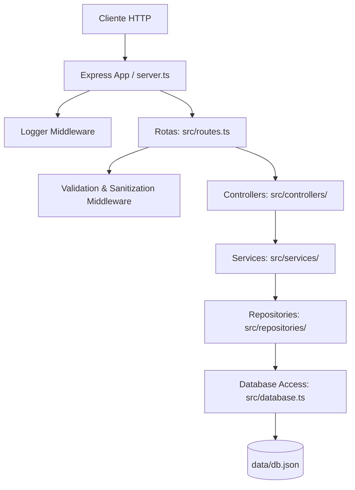

# Oxetech Helpdesk API — Projeto Final Integrador (AV3)

API REST de chamados de suporte acadêmico construída com Node.js, Express e TypeScript, modernizada e refatorada de forma incremental ao longo do curso de **Engenharia de Software Moderna**.

Este repositório consolida as três etapas de evolução da aplicação (AV1, AV2 e AV3 / Projeto Final Integrador), transformando um monólito legado e inseguro em uma arquitetura limpa em camadas, testável, segura, containerizada e com pipeline de CI automatizado.

> 📄 **Relatório Final da Evolução da Aplicação:** Para visualizar a justificativa completa de todas as decisões técnicas, histórico detalhado da refatoração e comparativos de código *Antes e Depois* desde o início do projeto, acesse o [**RELATORIO_FINAL.md**](file:///D:/Workspaces/OxeTech/oxetech-811-base-project/RELATORIO_FINAL.md).

---


## Requisitos

- Node.js 20 ou superior
- npm 10 ou superior
- Docker (opcional, para execução containerizada)

---

## Como Rodar Localmente

1. **Instalar dependências**:
   ```bash
   npm install
   ```

2. **Gerar dados de teste inicial (obrigatório na primeira execução)**:
   ```bash
   npm run seed
   ```

3. **Executar servidor de desenvolvimento (com hot-reload)**:
   ```bash
   npm run dev
   ```

A API estará disponível em: `http://localhost:3000/api`

---

## Como Rodar com Docker

Execução sem necessidade de ambiente Node local configurado:

```bash
# Construir imagem Docker multi-stage
docker build -t oxetech-helpdesk .

# Executar container (semeia o banco automaticamente)
docker run --rm -p 3000:3000 oxetech-helpdesk
```

Para persistir os dados entre reinicializações do container, monte um volume local no diretório `/app/data`:

```bash
docker run --rm -p 3000:3000 -v "$(pwd)/data:/app/data" oxetech-helpdesk
```

---

## Testes e Validação Automatizada

```bash
npm run lint       # Executa o linter (ESLint 9 com typescript-eslint)
npm run typecheck # Valida a tipagem sem emitir código (tsc --noEmit)
npm test          # Executa a suíte de 28 testes unitários (Vitest)
npm run build     # Compila a aplicação TypeScript para dist/
```

> **Integração Contínua (CI):** O workflow do GitHub Actions (`.github/workflows/ci.yml`) executa automaticamente `lint` → `typecheck` → `test` → `build` a cada push ou Pull Request nas branches `main`, `develop`, `feature/av2` e `feature/av3`.

---

## Scripts Disponíveis

- `npm run dev`: Inicia o servidor Express em modo de desenvolvimento (`tsx watch`).
- `npm run seed`: Cria/reseta a base de dados JSON em `data/db.json`.
- `npm run lint`: Executa a verificação estática do código com o ESLint.
- `npm run typecheck`: Executa a validação de tipos TypeScript.
- `npm run build`: Compila o projeto TypeScript para Javascript em `dist/`.
- `npm start`: Inicia o servidor em ambiente de produção (`node dist/server.js`).
- `npm test`: Executa todos os testes unitários com Vitest em modo execução única.
- `npm run test:watch`: Executa os testes em modo interativo/observação.

---

## Arquitetura e Padrões de Projeto

A aplicação foi completamente refatorada para a **Arquitetura em Camadas (Decoupled Layered Architecture)** com injeção de dependências manual:



### Padrões Aplicados

1. **Repository Pattern (`src/repositories/`)**:
   - `UserRepository` e `TicketRepository` desacoplam o acesso aos dados em arquivo JSON. A regra de negócio não possui qualquer acoplamento com o método de persistência.
2. **Strategy Pattern (`src/services/TicketService.ts`)**:
   - As regras de cálculo de prioridade foram decompostas em estratégias isoladas (`UrgentPriorityRule`, `HighPriorityRule`, `MediumPriorityRule`, `DefaultPriorityRule`) que implementam a interface `IPriorityRule`. O `PriorityCalculator` encadeia a avaliação das regras de forma extensível sem condicionais aninhadas.
3. **Dependency Injection (Injeção de Dependências)**:
   - Repositórios e serviços são injetados via construtor nas classes de serviço e controlador, facilitando mockagem em suítes de testes unitários.
4. **Middlewares Centralizados**:
   - **`logger.middleware.ts`**: Registra requisições HTTP com timestamps, status code e tempo de resposta.
   - **`validation.middleware.ts`**: Executa validações de tipo, enums, strings não vazias e sanitização contra Script Injection (`sanitize.util.ts`).
   - **`error.middleware.ts`**: Intercepta exceções operacionais `AppError` e erros inesperados, padronizando a resposta HTTP em `{ "error": "mensagem" }`.

---

## Endpoints da API

| Método | Endpoint | Descrição |
|---|---|---|
| `GET` | `/api/health` | Diagnóstico de integridade, uptime e verificação de banco de dados |
| `GET` | `/api/users` | Lista usuários do sistema (sem expor a propriedade `password`) |
| `GET` | `/api/tickets` | Lista chamados (suporta filtros: `?status=`, `?category=`, `?search=`) |
| `GET` | `/api/tickets/summary` | Retorna o resumo consolidado de status e chamados urgentes |
| `GET` | `/api/tickets/:id` | Detalha um chamado com solicitante, responsável e comentários enriquecidos |
| `POST` | `/api/tickets` | Cria um novo chamado (valida `category`, calcula prioridade e gera UUID) |
| `PATCH` | `/api/tickets/:id/status` | Atualiza o status de um chamado (exige comentário se `closed`) |
| `POST` | `/api/tickets/:id/comments` | Adiciona um comentário a um chamado existente |

---

## Histórico de Evolução (AV1 → AV2 → AV3)

- **AV1 (Refatoração Inicial & Clean Code)**:
  - Correção da falha de segurança em `GET /users` (ocultação de senhas com `PublicUser`).
  - Desacoplamento inicial de `database.ts`.
  - Remoção de números mágicos (`220`) e strings mágicas (`TicketStatus`, `TicketCategory`).
  - Padronização das respostas de erro HTTP com `{ "error": "..." }`.
- **AV2 (Arquitetura, Testes, Docker & CI)**:
  - Reestruturação completa em camadas (Repository → Service → Controller).
  - Otimização do algoritmo `enrichTicket` de $O(N \times M)$ para $O(N + M + C)$ via `Map`.
  - Aplicação do Strategy Pattern para cálculo de prioridades.
  - Implementação de middleware de validação de entrada e tratamento de erro global.
  - Ocultação visual de diffs de lockfile via `.gitattributes`.
  - Criação de Dockerfile multi-stage e pipeline do GitHub Actions (CI).
- **AV3 (Projeto Final Integrador)**:
  - Adição de middleware de logging de requisições HTTP (`logger.middleware.ts`).
  - Aprimoramento do endpoint `/api/health` com diagnósticos em tempo real de uptime e banco de dados.
  - Substituição de geradores de ID com timestamp por UUIDs nativos seguros (`crypto.randomUUID()`).
  - Implementação de sanitização de strings contra Script Injection / XSS (`sanitize.util.ts`).
  - Expansão da suíte de testes unitários para 28 testes automatizados cobrindo controllers, middlewares e utilitários.
  - Documentação final consolidada e Relatório de Evolução Integrador (`PR_AV3.md`).
